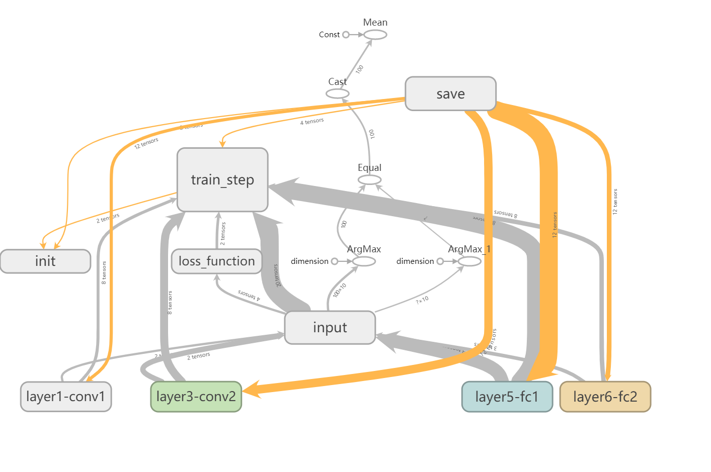
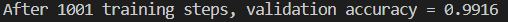

# 基于卷积神经网络(CNN)与MNIST数据集的分类任务

> 时间：2019-07-05

## 文件结构

|   名称   |  描述    |
| ---- | ---- |
|   MNIST_data\   |  数据集本身    |
|    log\  |   训练过程中的日志文件   |
|   model\   |  保存的训练完成的模型文件    |
|   data\   |  关于记录编写的其他文件    |
|   mnist_inference.py   |  模型的预测部分（前向传播）  |
|   mnist_train.py   |  模型的训练部分（反向传播）  |
|   mnist_eval.py   |  模型的评估器   |

## 模型结构细节

### a. 预测部分

1. 输入层：784个节点（等于输入图片像素）
2. 隐藏层：共两层
   1. 卷积层，采用5*5卷积核，深度为32，不采用全0填充，步长为1，激活函数为ReLU
   2. 池化层，采用2*2最大池，长宽步长均为2
   3. 卷积层，采用5*5卷积核，深度为64，不采用全0填充，步长为1，激活函数为ReLU
   4. 池化层，采用2*2最大池，长宽步长均为2
   5. 全连接层，512个节点，L2正则，激活函数为ReLU，训练过程中dropout为50%
3. 输出层：10个节点 （等于输出类别数目），L2正则

### b.训练部分

1. 采用AdamOptimizer进行优化
2. 采用交叉熵平均值与正则化损失的和为损失函数  

	

3. 采用指数衰减法调整学习率
4. 对训练完成的模型进行保存，便于后续评估调用

### c. 评估部分

1. 调用前阶段保存的模型，基于MNIST的测试集进行评估。

## 测试结果与反思

### 测试结果

对于本项目的网络模型，训练次数为1k，在MNIST数据集上达到了99.16%的正确率。

### 结果反思

以下纪录在模型训练与调整中遇到的问题

1. 对于较高的学习率初值，在训练初期可能出现无法收敛的情况；为此应调整学习率初值。（一般1e-2到1e-5）

2. 训练过程中，全连接层采用dropout可以显著地避免过拟合，提高模型的泛化能力。

3. 复杂的网络模型将会大幅影响模型训练的速度。
   （例如：在池化层1与卷积层2间插入一个Inception-v3模块，利用云计算资源进行训练，在3k次训练时可以达到99.26%的正确率，但模型训练的时间增加了约6倍）

   

