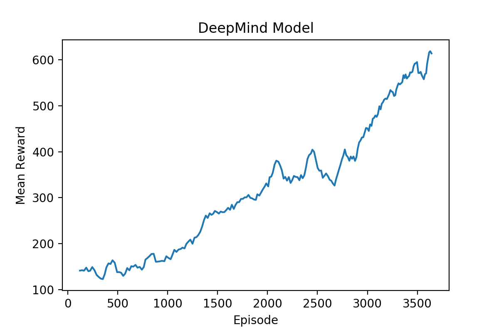
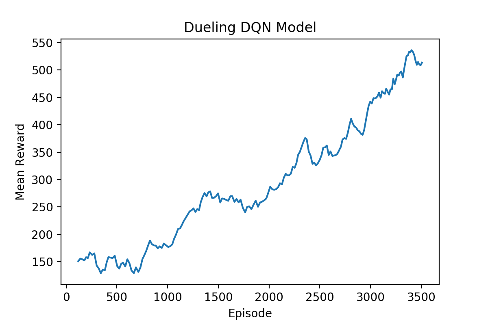
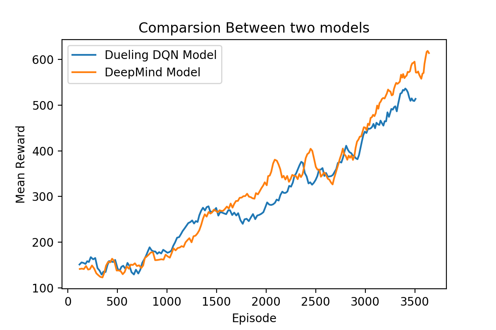

# 基于Dueling DQN的Atari游戏AI模型

> 时间：2019-07-14
> 以下部分代码参考了 UCB CS294 HW3 中的课程代码，[代码库链接](https://github.com/berkeleydeeprlcourse/homework/tree/master/hw3)

## 项目文件结构
| 名称              | 描述                                              |
| ----------------- | ------------------------------------------------- |
| log\              | 实验过程中输出的日志文件                          |
| experiments\      | 训练过程中保存的模型                              |
| img\              | 文档中展示的部分图片                              |
| atari_wrappers.py | 调用OpenAI gym Atari 环境接口的脚本               |
| logz.py           | 训练过程的记录脚本                                |
| DQN_utils.py      | DQN依赖脚本，定义了损失函数，学习率变化情况等信息 |
| DQN_learn.py      | DQN学习脚本，定义了具体的学习过程                 |
| DQN_train.py      | DQN训练脚本，模型的训练入口                       |

## 测试环境

> 使用的测试环境如下：
>
> Python == 3.6  
> tensorflow == 1.14.0 (GPU  version)  
> gym ==  0.10.5 (注意最新版本gym可能无法正常运行)  
> opencv-python == 4.1.0.25  
> numpy == 1.16.4  
>
> 训练机配置如下：
>
> CPU : I7-8700 (6C12T)   
> GPU: RTX2060 (6G)    
> CUDA = v10.0   
> cuDNN = v7.3.1 

## 处理流程

1. 初始化gym环境，取连续4帧图像，进行二值化，裁剪后作为输入数据。
2. 初始化网络模型，填充Replay Buffer
3. 对Replay Buffer进行采样，基于Exploration rate作出决策，用反馈的reward更新q_funtion（调整网络模型的参数）
4. 持续训练，对训练过程中的数据进行输出

## 模型网络结构

| 名称      | 描述                                                         |
| --------- | ------------------------------------------------------------ |
| conv1     | 卷积层，深度为32，卷积核大小为8x8，步长为4，激活函数为ReLU   |
| conv2     | 卷积层，深度为64，卷积核大小为4x4，步长为2，激活函数为ReLU   |
| conv3     | 卷积层，深度为64，卷积核大小为3x3，步长为1，激活函数为ReLU   |
| faltten   | 将卷积的结果展平为一维张量                                   |
| V_fc1     | Value函数的全连接层，以flatten为输入，节点数为512，激活函数为ReLU |
| Value     | Value函数的结果，节点数为1                                   |
| A_fc1     | Advantage函数的全连接层，以flatten为输入，节点数为512，激活函数为ReLU |
| Advantage | Advantage函数的结果，节点数为4（合法动作的数量）             |
| out       | q_func的结果，综合考虑了Value与Advantage的结果               |

## 模型训练结果

以下选取两次结果（分别为DQN与Dueling DQN模型，其他结构与参数相同，参考了DeepMind的[论文](https://arxiv.org/abs/1312.5602v1)）进行说明

### DeepMind 原始模型

> Reward-episode图像

在3500个episode的训练后，模型的平均reward（游戏分数）由150提升到600+

### Dueling DQN 模型

> Reward-episode图像

在3500个episode的训练后，模型的平均reward由150提升到500+

### 模型对比

可以看到，两个模型的表现并没有显著的不同。一定程度上可能是由于Dueling DQN模型需要训练的参数个数多余DQN模型，导致训练的难度加大。

### To be continued