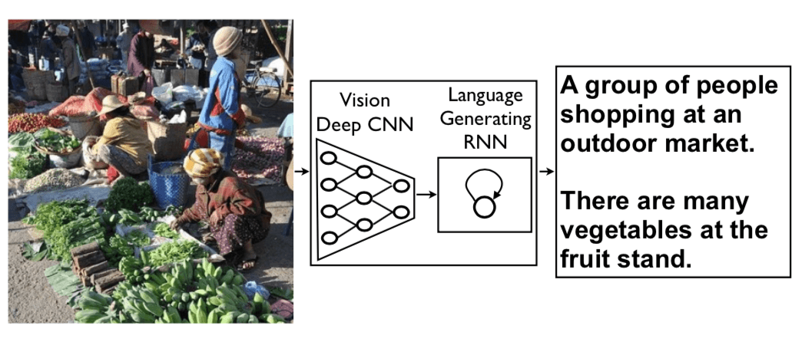

# Show and Tell : Image Caption based on NIC

>  时间：2019-07-22   
>  本项目是对 [*Show and Tell: A Neural Image Caption Generator*](https://arxiv.org/abs/1411.4555) 论文的复现  
>  以下代码参考了 [此代码库](https://github.com/maz0318/nlpSummerCamp2019/tree/master/week4) 与 [此代码库](https://github.com/amundv/kth-sml-project)

## 文件结构

| 名称           | 描述                           |
| -------------- | ------------------------------ |
| temp\          | 自己实现的部分功能脚本         |
| log\           | 训练日志与模型的保存文件夹     |
| utils\         | 部分辅助脚本的保存文件夹       |
| pic\           | 文档所需的部分图片的保存文件夹 |
| process.py     | COCO数据集的预处理脚本         |
| data_loader.py | COCO数据集的Dataset定义脚本    |
| model.py       | 模型的定义脚本                 |
| train_nic.py   | 模型的训练脚本                 |

## 数据集

本项目采用的数据集为 [Common Objects in Context](http://cocodataset.org/), 具体信息如下：

- Training: 2014 Contest Train images [83K images/13GB]  
- Validation: 2014 Contest Val images [41K images/6GB]  
- Test: 2014 Contest Test images [41K images/6GB]  

## 运行环境

> 使用的运行环境如下：  
>
> torch == 1.0.1
> torchvision == 0.2.2
> pycocotools == 2.0.0
> pycocoevalcap == 0.0
>
> 训练机配置如下：  
>
> GPU : GTX 1080
> CUDA == 8.0.44

## 模型结构

NIC结构由两个模型构成：Encoder与Decoder. 

- Encoder：卷积神经网络，采用经过在 `ImageNet` 上预训练的 `ResNet152` 模型 (`torchvision.models.resnet152`) 并进行微调（*fine tuning*），目的是提取图片特征，创建对图片特征进行语义描述的定长向量（Feature Vector）

- Decoder：循环神经网络，采用LSTM/GRU作为结构单元，目的是在 Feature Vector 的基础上生成对图片的自然语言描述文本（Caption）

  

	> 以上图片来源于[此处](https://github.com/amundv/kth-sml-project)

## 模型训练与结果

### Loss

在训练过程中，模型的Loss基本呈稳定下降趋势。

### BlEU指标

在训练过程中，模型的各级BLEU分数均呈现上涨趋势，并在10个Epoch左右出现收敛的倾向。

### 多指标评价

以下给出训练过程中奇数次Epoch的训练评估结果作为参考

| Epoch | Bleu_1 | Bleu_4 | METEOR | ROUGE_L | CIDEr | SPICE |
| :----: | :----: | :----: | :----: | :-----: | :---: | :---: |
| 1     | 0.621  | 0.183 | 0.190 | 0.449 | 0.539 | 0.116 |
| 3 | 0.647 | 0.216 | 0.209 | 0.472 | 0.668 | 0.138 |
| 5 | 0.661 | 0.229 | 0.214 | 0.481 | 0.713 | 0.146 |
| 7 | 0.662 | 0.230 | 0.218 | 0.483 | 0.725 | 0.146 |
| 9 | 0.669 | 0.237 | 0.222 | 0.489 | 0.747 | 0.151 |
| 11 | 0.663 | 0.238 | 0.224 | 0.489 | 0.757 | 0.153 |
| 13 | 0.669 | 0.242 | 0.225 | 0.491 | 0.762 | 0.153 |
| 15 | 0.663 | 0.235 | 0.224 | 0.489 | 0.754 | 0.153 |
| 17 | 0.664 | 0.241 | 0.226 | 0.491 | 0.765 | 0.155 |

## 存在问题：

原论文中，在词语的生成选择阶段采用了Beam-size为20的Beam search。这提升了模型的BLEU指标约0.03。然而，对于自己实现的Beam search（在 `model.py\test_generate` 中实现），其计算速度远低于简单的贪婪算法。

根据分析可知，对每一组输入数据，贪婪算法仅需通过LSTM层，计算最多**20次**词语的概率分布（O(N)）。但对于Beam-size为20的Beam search，序列长度每增加1，都需要对当前所存储的所有状态计算一次概率分布（O(N^2)）。此外，还有大量的保存/恢复state，对概率序列进行排序（通过heapq实现）等操作。根据检验，使用个人实现的Beam search使评估的时间增加了约10倍。因此没有对其表现进行实际的评价。